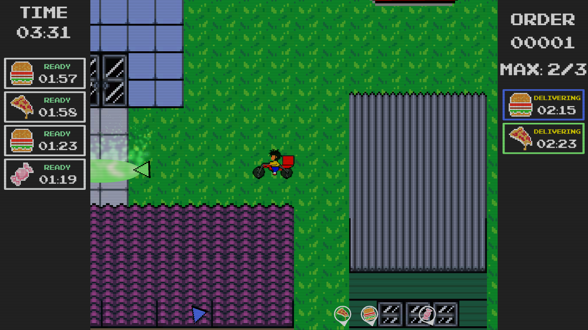
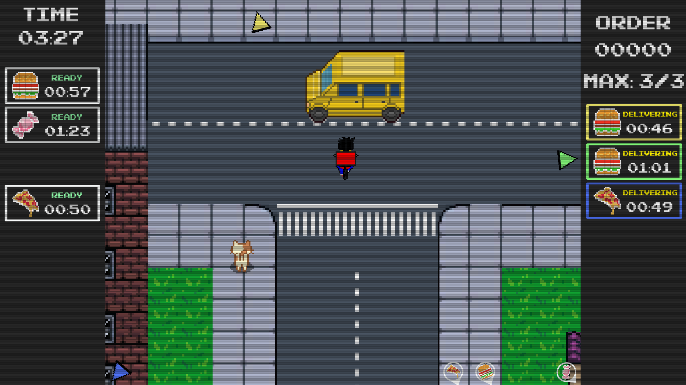
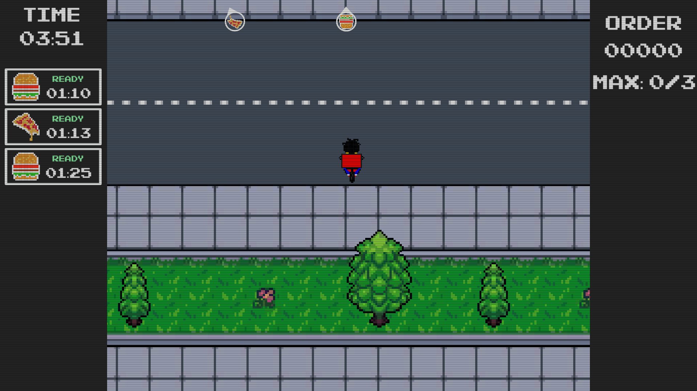
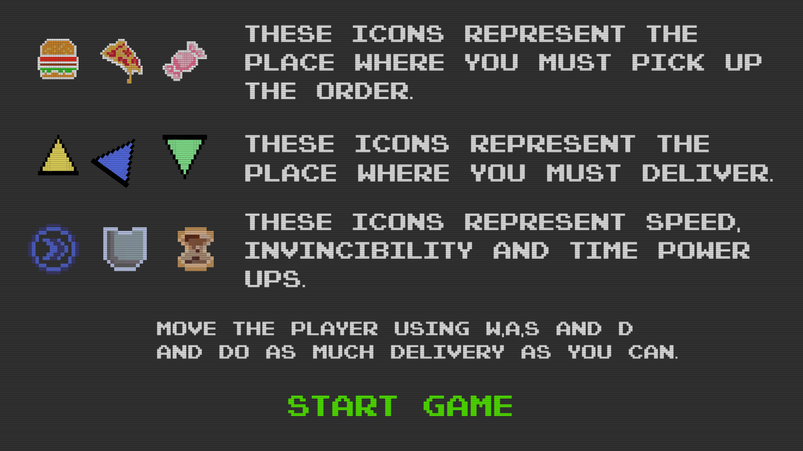

# ldjam_53

In DeliveryBoy, you assume the role of a delivery boy who will deliver orders by bicycle. With your agility and ability to navigate through the busy streets of the city, you must meet the deadline for each delivery.

The journey won’t be easy as there are obstacles on the way that require skill and attention. But don’t worry, there are power-ups scattered along the way that can help you deal with these challenges.

DeliveryBoy is a game that will keep you entertained for hours on end. It’s important to note that some of the assets used in the game were acquired from third parties and were not developed by our own team.

So put on your helmet, hop on your bike, and get ready to face exciting challenges in DeliveryBoy!

DeliveryBoy was inspired by two other popular games, Paperboy and Overcooked. Paperboy is a classic arcade game from the 1980s that tasks players with delivering newspapers while avoiding obstacles and delivering to the correct houses. Overcooked is a modern cooperative game where players work together to prepare and deliver food orders while navigating through various obstacles.
ldjam - https://ldjam.com/events/ludum-dare/53/delivery-boy-4
itch - https://mateusculpo.itch.io/deliver-boy
